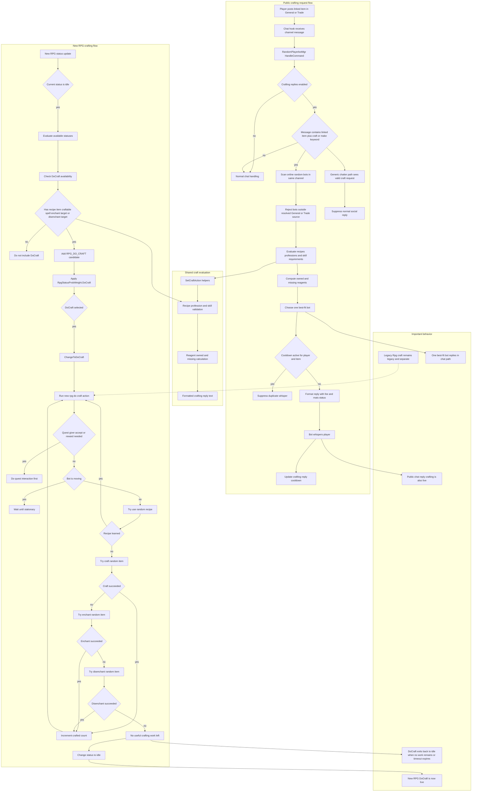

# Crafting RPG flow

This file visualizes the currently live crafting-related behavior in `mod-playerbots`.

It covers two connected systems:

- **Public crafting reply flow**: a player asks in `General` or `Trade` for a crafted item and one eligible bot whispers back.
- **New RPG crafting flow**: random bots can now enter a dedicated `RPG_DO_CRAFT` state and perform profession work on their own.

## Mermaid overview

## Reading guide

- The **left side** shows the player-facing service flow.
- The **right side** shows the autonomous bot-side crafting loop in the new RPG system.
- The **shared block** highlights the common validation logic reused by the chat crafting features.

## Config knobs

- `AiPlayerbot.EnableCraftingReplies`
- `AiPlayerbot.CraftingReplyCooldown`
- `AiPlayerbot.RpgStatusProbWeight.DoCraft`
