# mod-playerbots RPG flows and interactions

This file documents the currently wired RPG behavior in `mod-playerbots`, including:

- legacy `rpg`
- `new rpg`
- public crafting request replies in chat
- shared systems such as travel, combat, and loot
- legacy side branches that exist in code but are not fully wired into `RpgStrategy`

## Full Mermaid map

```mermaid
flowchart TB
    subgraph ACT[Activation and engine setup]
        A1[Random bot non combat engine init] --> A2[Always add grind strategy for free random leader bots]
        A2 --> A3{Enable new rpg strategy}
        A3 -- yes --> A4[Add new rpg strategy]
        A3 -- no and auto do quests --> A5[Add legacy rpg strategy]
        A3 -- no and no auto quest --> A6[Fallback to move random]
        A7[Full reset] --> A8[Clear rpg target loot target ignore rpg target travel target and rpg info]
    end

    subgraph SH[Shared systems]
        S1[Travel target system]
        S2[Grind target value]
        S3[Combat attack and pull systems]
        S4[Available loot stack]
        S5[Loot target value]
        S6[Loot actions]
        S7[Possible target values for npc go and friendly player]
        S8[Quest vendor trainer taxi and gossip systems]
        S9[Chat routing and reply systems]
    end

    subgraph LEG[Legacy rpg flow]
        L1[Default action rpg] --> L2{Has rpg target}
        L2 -- no --> L3[Choose rpg target trigger]
        L3 --> L4[Scan possible rpg targets nearby game objects and friendly players]
        L4 --> L5[Drop ignored invalid and unfollowable targets]
        L5 --> L6[Evaluate trigger relevance for each candidate]
        L6 --> L7[Weighted pick best target]
        L7 --> L8[Store rpg target]

        L2 -- yes --> L9{Far from target}
        L9 -- yes --> L10[Move to rpg target]
        L10 --> L11[Move near npc go or player]
        L11 --> L12{Move failed or target invalid}
        L12 -- yes --> L13[Add target to ignore list and clear rpg target]
        L12 -- no --> L14[Stay with target]

        L9 -- no --> L15[Rpg dispatcher]
        L15 --> L16[Scan supported strategies containing rpg]
        L16 --> L17[Collect active rpg enabled actions]
        L17 --> L18[Weighted pick next sub action]
        L18 --> L19[Set next rpg action]
        L19 --> L20[Rpg action multiplier suppresses other rpg actions]

        L20 --> L21{Near target action family}
        L21 --> L22[Rpg stay]
        L21 --> L23[Rpg work]
        L21 --> L24[Rpg emote]
        L21 --> L25[Rpg cancel]
        L21 --> L26[Rpg discover]
        L21 --> L27[Rpg start quest]
        L21 --> L28[Rpg end quest]
        L21 --> L29[Rpg buy]
        L21 --> L30[Rpg repair]
        L21 --> L31[Rpg heal]
        L21 --> L32[Rpg home bind]
        L21 --> L33[Rpg buy petition]
        L21 --> L34[Rpg use]

        L22 --> L40[Idle at target]
        L23 --> L41[Use standing work emote]
        L24 --> L42[Gossip hello and random emote]
        L25 --> L43[Clear rpg target]
        L26 --> L44[Learn taxi node]
        L27 --> L45[Accept all quests]
        L28 --> L46[Talk to quest giver and complete quest]
        L29 --> L47[Vendor flow]
        L30 --> L48[Repair flow]
        L31 --> L49[Class heal on party]
        L32 --> L50[Bind home]
        L33 --> L51[Buy guild petition]
        L34 --> L52[Use game object]

        L40 --> L60[After execute keep facing target and set rpg delay]
        L41 --> L60
        L42 --> L60
        L44 --> L60
        L45 --> L60
        L46 --> L60
        L47 --> L60
        L48 --> L60
        L49 --> L60
        L50 --> L60
        L51 --> L60
        L52 --> L60
        L43 --> L61[Back to target selection]
        L60 --> L15
    end

    subgraph LEGX[Legacy side branches not fully wired]
        LX1[Rpg queue bg exists]
        LX2[Rpg spell exists]
        LX3[Rpg craft exists]
        LX4[Rpg trade useful exists]
        LX5[Rpg duel exists]
        LX6[Rpg mount anim exists]
        LX7[Rpg mount anim comes from emote strategy often]
        LX8[These branches exist in code but are not wired in the main legacy rpg strategy]
        LX1 -.-> LX8
        LX2 -.-> LX8
        LX3 -.-> LX8
        LX4 -.-> LX8
        LX5 -.-> LX8
        LX6 -.-> LX7
    end

    subgraph PUB[Public crafting request flow]
        P1[Player posts linked item request in General or Trade] --> P2[Playerbots chat hook receives channel message]
        P2 --> P3[Pass channel name to RandomPlayerbotMgr HandleCommand]
        P3 --> P4{Crafting replies enabled}
        P4 -- no --> P99[Fall back to normal channel handling]
        P4 -- yes --> P5{Message contains linked item and craft or make keyword}
        P5 -- no --> P99
        P5 -- yes --> P6[Iterate online random bots in same channel]
        P6 --> P7[Reject bots not resolved to General or Trade reply source]
        P7 --> P8[Build craft reply data from learned recipes and supported professions]
        P8 --> P9[Validate profession recipe and required skill]
        P9 --> P10[Calculate required available and missing reagents]
        P10 --> P11[Pick one best-fit bot]
        P11 --> P12{Per player and item cooldown active}
        P12 -- yes --> P98[Suppress duplicate whisper]
        P12 -- no --> P13[Format reply with profession skill fee and mats status]
        P13 --> P14[Selected bot whispers player]
        P14 --> P15[Update last said chat cooldown]
        P5 --> P16[Generic chat reply path notices craft request]
        P16 --> P17[Suppress normal social chatter for valid craft requests]
    end

    subgraph NEW[New rpg flow]
        N1[Default action new rpg status update] --> N2{Current rpg info status}
        N2 -- idle --> N3[Random change status]
        N3 --> N4[Filter by availability]
        N4 --> N5[Weight by config]
        N5 --> N6{Choose status}

        N6 --> N7[Go grind]
        N6 --> N8[Go camp]
        N6 --> N9[Wander random]
        N6 --> N10[Wander npc]
        N6 --> N11[Do quest]
        N6 --> N12[Travel flight]
        N6 --> N13[Farming]
        N6 --> N14[Rest]
        N6 --> N15[Outdoor pvp]
        N6 --> N17[Do craft]

        N7 --> N20[Store grind position]
        N8 --> N21[Store camp position]
        N9 --> N22[Enter random wander]
        N10 --> N23[Enter npc wander]
        N11 --> N24[Store selected quest state]
        N12 --> N25[Store flight master and path]
        N13 --> N26[Store farming position and gather state]
        N14 --> N27[Sit and idle]
        N15 --> N28[Store outdoor pvp objective state]
        N17 --> N29[Store craft work state]

        N20 --> NT1[Go grind status action]
        N21 --> NT2[Go camp status action]
        N22 --> NT3[Wander random status action]
        N23 --> NT4[Wander npc status action]
        N24 --> NT5[Do quest status action]
        N25 --> NT6[Travel flight status action]
        N26 --> NT7[Farming status action]
        N28 --> NT8[Outdoor pvp status action]
        N29 --> NT9[Do craft status action]

        NT1 --> NA1[Quest giver check then move far to grind spot]
        NT2 --> NA2[Quest giver check then move far to camp]
        NT3 --> NA3[Move random near]
        NT4 --> NA4[Choose npc or go move interact and linger]
        NT5 --> NA5[Quest giver pass choose poi move and rely on normal combat and loot]
        NT6 --> NA6[Move to flight master activate taxi and wait for landing]
        NT7 --> NA7{Tracked gather node}
        NT8 --> NA8[Choose and patrol outdoor pvp capture point]
        NT9 --> NA16[Learn random recipe then craft enchant or disenchant if useful]

        NA7 -- yes --> NA9[Queue node into available loot and loot target]
        NA9 --> NA10[Move to node if needed]
        NA10 --> NA11[Normal loot and gather pipeline handles interaction]
        NA7 -- no --> NA12{Gather search delay elapsed}
        NA12 -- yes --> NA13[Find nearby gathering target]
        NA13 --> NA14[Prefer reachable herb ore skinning and cloth opportunities]
        NA14 --> NA9
        NA12 -- no --> NA15[Stay near farming area and move far or move random near]

        N2 -- go grind --> NX1{Reached grind spot}
        NX1 -- yes --> N22
        N2 -- go camp --> NX2{Reached camp}
        NX2 -- yes --> N23
        N2 -- wander random --> NX3{Expired}
        NX3 -- yes --> N16[Set status to idle]
        N2 -- wander npc --> NX4{Expired}
        NX4 -- yes --> N16
        N2 -- do quest --> NX5{Done timeout or abandon}
        NX5 -- yes --> N16
        N2 -- travel flight --> NX6{Flight finished}
        NX6 -- yes --> N16
        N2 -- farming --> NX7{Expired}
        NX7 -- yes --> N16
        N2 -- rest --> NX8{Expired}
        NX8 -- yes --> N16
        N2 -- outdoor pvp --> NX9{No valid objective or invalid zone}
        NX9 -- yes --> N16
        N2 -- do craft --> NX10{No craft work left or expired}
        NX10 -- yes --> N16
        N16 --> N1
    end

    subgraph X[Cross system interactions]
        X1[Choosing a new travel target clears rpg target and pull target]
        X2[Travel work state may set rpg target to a nearby friendly or neutral unit]
        X3[Legacy rpg end quest may stay relevant when target entry matches travel target entry]
        X4[New rpg quest and farming reuse normal combat and loot execution]
        X5[Grind target value is farming aware in farming status]
        X6[Farming combat priority becomes skinnable mobs first and cloth humanoids second]
        X7[Legacy Rpg craft is still unwired but new rpg do craft and public crafting replies are live]
    end

    L4 --> S7
    L27 --> S8
    L28 --> S8
    L29 --> S8
    L30 --> S8
    L32 --> S8
    L33 --> S8
    L34 --> S8
    P2 --> S9
    P8 --> S9
    N25 --> S8
    NA5 --> S2
    NA9 --> S4
    NA9 --> S5
    NA11 --> S6
    NA8 --> S1
    N13 --> X5 --> X6 --> S2
    S2 --> S3 --> S4

    S1 --> X1
    S1 --> X2
    X2 --> L8
    X1 --> L43
    X3 --> L28
    X4 --> S2
    X4 --> S4
    X4 --> S5
    X4 --> S6
    LX3 --> X7
    X7 --> P3

    A4 --> N1
    A5 --> L1
```

## Notes

- The **legacy `rpg`** system is target-centric: choose a target, move to it, then choose a target-specific RPG sub-action.
- The **`new rpg`** system is state-centric: choose a state, store state in `rpgInfo`, then run the action attached to that state.
- The **public crafting reply** system is chat-centric: a player posts a linked item request in General or Trade, `RandomPlayerbotMgr` evaluates online bots, then exactly one best-fit crafter whispers back.
- `RPG_FARMING` is distinct from legacy grind logic, but it still reuses shared combat and loot systems.
- Public crafting replies are gated by `AiPlayerbot.EnableCraftingReplies` and rate-limited by `AiPlayerbot.CraftingReplyCooldown`.
- `SetCraftAction` is now shared infrastructure: it still powers direct craft setup, but it also parses public craft requests, validates recipes and profession skill, and formats the reply text.
- `ChatReplyAction` suppresses generic chatter on valid craft requests so the public whisper path does not compete with normal social replies.
- Several legacy RPG actions exist in code but are **not currently wired into `RpgStrategy::InitTriggers`**. That still includes legacy `Rpg craft`, which is separate from the live public crafting-request reply path.
